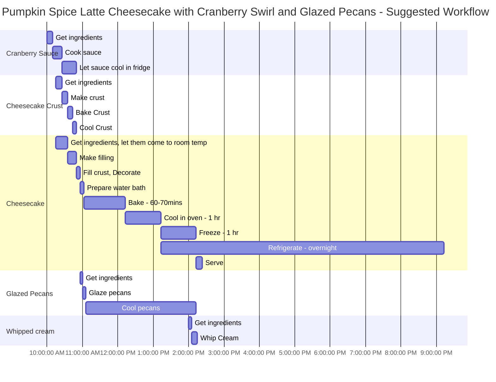

---
tags:
  - recipes
  - events/thanksgiving
---

```mermaid
gantt
%%{
  init: {
    'theme': 'base',
    }
}%%
    title Pumpkin Spice Latte Cheesecake with Cranberry Swirl and Glazed Pecans - Suggested Workflow
        dateFormat  H:mm
        axisFormat %X
    section Cranberry Sauce
        Get ingredients :a0, 10:00, 10m
        Cook sauce                     :a1, after a0, 15m
        Let sauce cool in fridge       :after a1, until b4
    section Cheesecake Crust
        Get ingredients                         :b0, 10:15, until b1
        Make crust               :b1, after a1, 10m
        Bake Crust                              :8m
        Cool Crust                              :until b4
    section Cheesecake
        Get ingredients, let them come to room temp :10:15, until b3
        Make filling                                :b3, after b1, 15m
        Fill crust, Decorate                        :b4, after b3, 6m
        Prepare water bath                          :b5, after b4, 7m
        Bake - 60-70mins                            :b6, after b5, 70m
        Cool in oven - 1 hr                         :b7, after b6, 1h
        Freeze - 1 hr                               :b8, after b7, 1h
        Refrigerate - overnight                     :b9, after b7, 8h
        Serve                                       :b10, after b8, 10m
    section Glazed Pecans
        Get ingredients                :c0, after b4, 5m
        Glaze pecans                   :c1, after c0, 5m
        Cool pecans                    :after c1, until b10
    section Whipped cream
        Get ingredients                :d0, 14:00, 5m
        Whip Cream                     :d1, after d0, 10m
```

https://docs.google.com/document/d/1ego6X95dMgUHvoI9-kaXZnOTLokpBYsBDizCYW8H8X0/edit?usp=sharing

